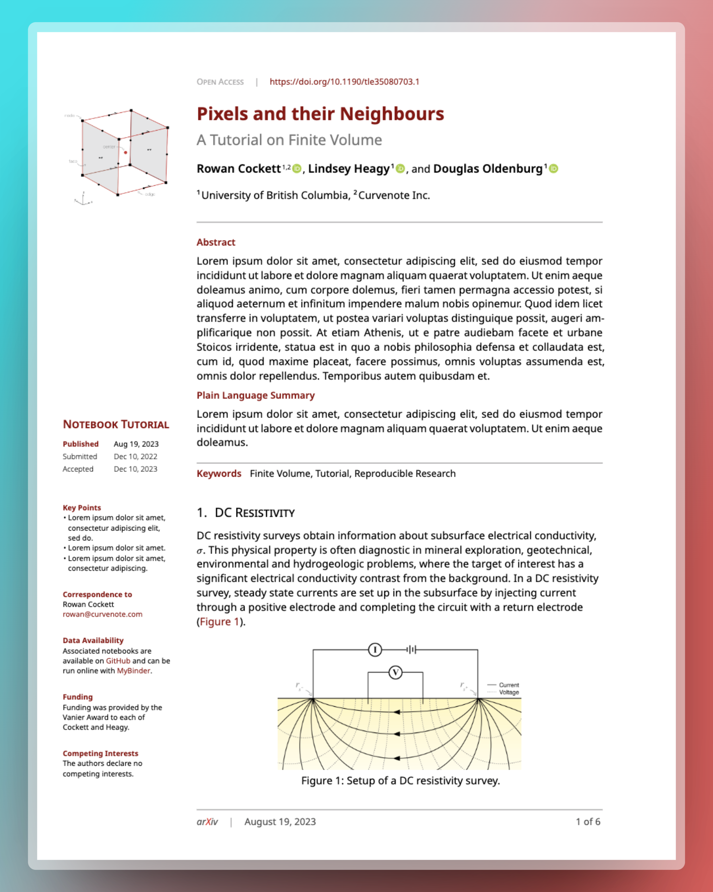

<h1 align="center">LaPreprint for Typst</h1>

  

  <b>A template for easily creating pretty, nicely formatted preprints in Typst.</b> 
  <b>Want to use this template again?<a href="https://github.com/rowanc1/LaPreprint/"> See original repo.</a></b>

# Features

With simple options you can enable/disable:

- color schemes of blue, red, purple
- author, ORCID, and affiliation support
- branding and logo support
- left margin with custom headings
- date accepted, published & submitted
- customizable font choices
- running title, affiliation
- abstract and plain language summary
- keywords, page count, nice headings
- easily customize APA or IEEE citation style
- Optional: full width after first page

# Quick start

🎉 The only file you need is the `lapreprint.typ` 🎉

1. Click `Use this template`
2. Open the document in your preferred environment (e.g. VSCode)
3. In `main.typ`, edit the template information
4. Start writing!

# Acknowledgements

The Typst LaPreprint template (and this Readme!) is inspired by [@roaldarbol LaTeX template](https://github.com/roaldarbol/LaPreprint), which is in the style of eLife and PLoS. Portions of the template were based on the example IEEE template in Typst.
